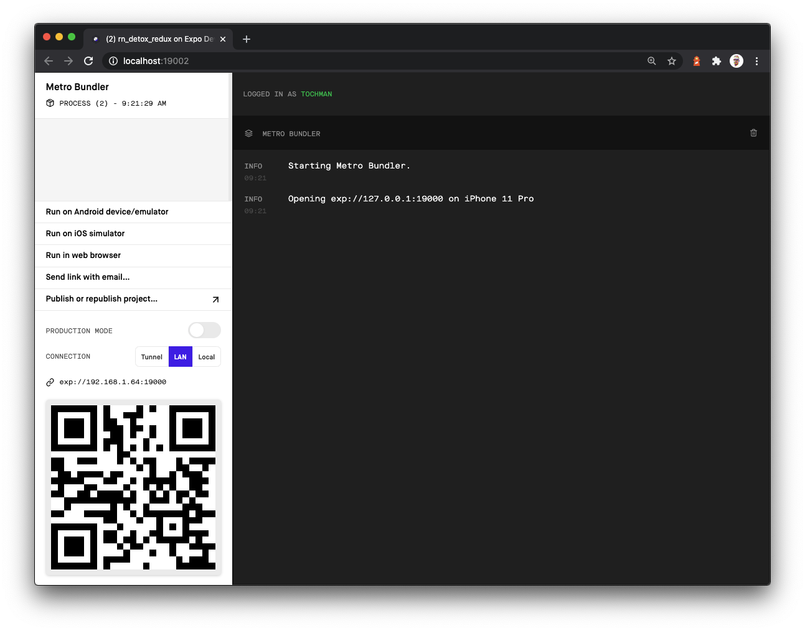
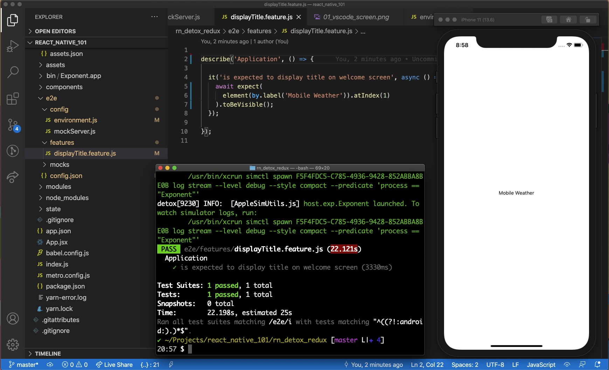

## Setup
All development enviroments require initial configuration. Before we get started with the actual programming we have to get past some setup chores.

In this part of the documntation we will:
1. create an React Native application using Expo CLI
2. set up Application State using Redux
3. configure the testing framwork


### Part 1 - Application structure
```
$ yarn global add expo-cli
```

Try the Expo CLI in your terminal by simply typing `expo` and hitting enter. You should get a list of  commands available in the cli-tool. If you don't, you will have to reconfigure your `yarn` setup or use `npm global` instead (see the "Toubleshooting" section of this documntation).

Once the command has executed and all dependecies have been installed, this should result in th following output:

```
success Installed "expo-cli@3.28.5" with binaries:
      - expo
      - expo-cli
✨  Done in XX.XX.
```

The version number of the installed application may differ on your system, of course.

Let's use the Expo CLI to scaffold a React Native application. We do that by using the `expo init` command. We choose to use a minimal template and NOT use Typescript in this example app.

```
$ expo init --template blank rn_detox_redux
```
Once the scaffolder is done with creating the app and installing the dependencies (it might take a while dependent on your computer's capacity and network connection speed), `cd` into the newly created folder. Now, you can start your application in the phone simulator of your choice. When writing this documentatio, I was on an OsX based machine, so I will use the iPhone simulator.

Issue the following command in your terminal:
```
$ yarn ios
```
This starts the Metro bundler, essentially a HTTP server that compiles our code with Babel to target the latest JavaScript features.
You will will notice that a new browser window opens, and after a short while, once your new application has compiled, a phone simulator will appear and eventually display the app. All of this might take a while as there are many processes happening at the same time.



**(Note: You can stop the runner with Control + C kys on a OsX)**
The application that appears has only one view with som placeholder text in the center.


The text on the view tells us to “Open up App.js to start working on your app!. So let's take a look at the code in our IDE (I'm using VSCode in this example). If you have your VSCode terminal command enabld, you can open the project directly from your terminal prompt. Otherwise, you will need to navigate to the project from within VSCodee and open it manually.

```
$ code .
```


Change some text and run see it appear on the view in the simulator. You can always reload the app (and perform other actions that we will cover later on in this documentation) by accessing the Control Panel in your expo app. Press **Control Command Z** on your keyboard while the simulator window is in focus to access the controls and click on 'Reload':


### JSX support
I like to name my components with the `.jsx` suffix. In order for that to work, we need to modify Metro configuration and tell it to look for **both** `.js` files **as well as** `.jsx`. This is pretty straight-forward, so let's go ahead and do this.

Create a file named `metro.config.json` in your projects root folder. Add the following configuration:

```js
module.exports = {
  resolver: {
    sourceExts: ['jsx', 'js']
  }
};
```
Now, you can **rename** `App.js` to `App.jsx` and restart the application server for thee changes to take effect.

## Part 2 -  Application state

We want to manage the state of our application using Redux. For that to happen, we need to take control of the application's configuration in a way that differs a bit from what the scaffolded app gives us. We will also chagne the application structure a bit, to better suite our needs.

So, more configuration...

First of all, we want to create a new file in the projects root folder and name it `index.js`. This file need to have the following content:

```js
import { registerRootComponent } from 'expo';
import App from './App';

registerRootComponent(App);
```

(We will get back to this file and modify it's content in a short while.)

We also need to modify the `"main"` key in our `package.json` to point to that `index.js` file (this key already exists, so this is a **change** not an **addition**):

```json
"main": "index.js",
```
Make sure to restart your application server and check if everything is working at this stage. You don't want to  move on before you know that you are in a good state.

Furthermore, we want to organize our code in some subfolders. We might as well create them now. Create folders named `components`, `modules` and `state` in your projets root folder. In the two first folders, we only want to add a hidded file named `.gitkeep` (this file is used to Git that it should track the folder even if it is empty), but in the `state` folder we want to create two subdirectories: `store` and `reducers`

 The structure should look like this once you are done:


```
├── App.jsx
├── assets
├── components
├── modules
└── state
    ├── reducers
    └── store
```

Okay, naw that we have these chores behind us, we can move on with adding and configuring Redux. We will add two libraries to our application. `redux` and `react-redux`.

```
$ yarn add redux react-redux
```

#### Initial state
Let’s start with the initial state. For demonstration purposes, we want to set an application name in our state and display it on our view. We can do that by setting an initial state that we will place in a separate file in the `state/store` folder:

```js
// /state/store/initialState.js
const initialState = {
  appTitle: 'Mobile Weather'
}
export default initialState
```

#### The Reducer
In Redux, state is managed by reducer functions. As the next step, we will create a simple reducer that will load the initial state and return it to whoever asks for/subscribes to it:

```js
// /state/reducers/rootReducer.js
import initialState from '../store/initialState'

const rootReducer = (state = initialState) => {
  return state
}
export default rootReducer
```

#### The Global Store
And we will set up and configure the global store object:

```js
// src/state/store/configureStore.js
import { createStore } from 'redux';
import rootReducer from '../reducers/rootReducer'

const configureStore = () => {
  return createStore(rootReducer);
}
export default configureStore
```

#### Connecting the Redux parts with the app
As the next step, we need to connect our application to the Redux store. We will do that in our applications main entry point (`index.js`) by importing the store configuration (from `state/store/configureStore.js`) and making use of the `Provider` component from the `react-redux`library we added before. The `Provider` component makes the Redux store available to any nested components. Please note the imports and the usage of the `React` library, `Provider` and `configureStore()` in the code below:

```js
import React from 'react';
import { Provider } from 'react-redux'
import configureStore from './state/store/configureStore';
import { registerRootComponent } from 'expo';

import App from './App';

const store = configureStore();

const ConnctedApp = () => <Provider store={store}><App /></Provider>

registerRootComponent(ConnctedApp);
```

Please note how we pass in the `store` object to the `<Provider>` component as a propery (`props`) and use it as a wrapper around the `<App>` component. Also, please note that we **change** what componnt will become th root component of tha application - `registerRootComponent(App)` was changed to `registerRootComponent(ConnctedApp)`.

#### Use state in a component

If we move over to our App component (`App.jsx`) we can make use of the `useSelector` hook and subscribe to the value `appTitle` that we added to the applications state.

Please note that the code example below anly reflects the neccessary **additions** and **changes**. As always, you have to make sure that you keep the relevant code that we choose to omit in code examples/snippets of this documentation.

```js
// omitted code...
import { useSelector } from "react-redux";

const App = () => {
  const appTitle = useSelector(state => state.appTitle) // get the value from application state
  return (
    <View style={styles.container}>
      <Text>{appTitle}</Text>
      <StatusBar style="auto" />
    </View>
  );
}
```
If you reload your application in the simulator, you should sew the value you added to the `appTitle` key in the `initialState` displayed on the view.


### Part 3 - Testing with Detox

Let's get started with the setup by installing the Detox CLI

```
$ yarn global add detox-cli
```

Next, we need to add Detox and a few Expo integration packages to the project:
```
$ yarn add -D detox detox-expo-helpers expo-detox-hook jest-expo
```

Let's have another round of configuration chors to get Detox set up and ready to go.

One of the first things we need to do is to download a built version of the Expo iOS app that Detox can use to hook into. Point your browser to the [Expo Tools](https://expo.io/tools#client) page and click the “Download IPA” link. Expand the downloaded archive, and change the name of the folder to “Exponent.app”. Create a folder named `bin` folder in your projects root folder, and move `Exponent.app` folder into it.

```
.
├── bin
│   └── Exponent.app
```
### Git Large File Storage (LFS)

The  `Exponent.app` folder is quite big, and will cause problems for you if you check it in as it is into Git. There are 2 possible scenarios to deal with it.
1. Exclude the folder from Git in your `.gitignore` and have every developer go through the process of downloading the app themselves.
2. Make use of Large File Storage mechanism in Git and check the folder in to Git as usual.

**For learning purposes, we will go over the LFS solution, but feel free to omit this step and got with scenario 1 if you wish.**

Git Large File Storage (LFS) replaces large files such as audio samples, videos, datasets, and graphics with text pointers inside Git, while storing the file contents on a remote server like GitHub.com or GitHub Enterprise.

You can install LFS using Homebrew:
```
$ brew install git-lfs
```
Once the package is installed, you need to run the following command to add it to your git configuration:

```
$ git lfs install
```

Now, let's tell LFS that we want to track The `Exponent.app` folder:

```
$ git lfs track "**/bin/Exponent.app"
```
That will create a new file in our root folder named `.gitattributes`. Make sure to stage it and make a commit. Pushingg up to GitHub should not pose a problem now.

### Detox configuration
We have a few more chres to get out of our way. We ned to prepare our test runner and configure Detox. According to the documentation for Detox, we sshould be able to run an installeer to go through this step, but I've found that I have to make a lot of madifications to the standarlized configuration, that we might as well go through this step manually.

Let'ss start with addingg some Detox configuration to `package.json`:

```json
"detox": {
    "testRunner": "jest",
    "runnerConfig": "e2e/config.json",
    "configurations": {
      "ios": {
        "type": "ios.simulator",
        "binaryPath": "bin/Exponent.app",
        "device": {
          "type": "iPhone 11"
        }
      }
    }
  }
```
**Note: In this documentation, we'll only be covering the iOS configuration for Detox. A qiock Google search will lead you to a configuration example for Android.**

We will now create a new folder (in the projects root) that we will name `e2e`. Inside that folder, we will create 2 subfolders (`config` and `features`) as well as 1 file named `config.json`.

```
.
├── e2e
│   ├── config.json
│   ├── config
│   ├── features
│   └── mocks
```

In `config.json` we'll add the following:
```json
{
  "preset": "jest-expo",
  "testEnvironment": "node",
  "setupFilesAfterEnv": [
    "./config/environment.js"
  ],
  "testRegex": "(/features/.*|(\\.|/)(features|e2e))\\.(js?|ts?)$",
  "verbose": true
}
```

Moving on to `./config/environment.js`, and the setup of th test enviroment itself:

```js
import { cleanup, init } from "detox";
import { reloadApp } from 'detox-expo-helpers';
import adapter from "detox/runners/jest/adapter";

jest.setTimeout(120000);
jasmine.getEnv().addReporter(adapter);

beforeAll(async () => {
  await init();
});

beforeEach(async () => {
  await adapter.beforeEach();
  await reloadApp()
});

afterAll(async () => {
  await adapter.afterAll();
  await cleanup();
});
```

And, finally, we are ready to write our first test. Lets create a new file in the `features` subfolder and give it a name of `displayAppTitle.feature.js`. We'll bee checking for the application title we added to the view a while ago.

```js
describe('Example', () => {

  it('is expected to display title on welcome screen', async () => {
    await expect(
      element(by.label('Mobile Weather')).atIndex(1)
    ).toBeVisible();
  });

});

```
We can run the test from our terminal:
```
$ detox test
```

That's it in terms of configuration. It was a handful to say the least, but at this stage, we have a working setup that will allow us to work in BDD.

### Detox matchers, actions and expectations

Detox uses **matchers** to locate certain UI elements. Matchers can find elements in your app that match one or more properties. The different methods that are available to use are:
- `by.id()`
- `by.label()`
- `by.text()`
- `by.type()`
- `by.traits()`
It is recommended to match elements `by.id()` because it is more resilient to layout restructuring and text/language changes.

Detox also uses **actions** to emulate user interactions and behavior with elements we want to find and match. The different methods that are available to use are:
- `.tap()`
- `.longPress()`
- `.multiTap()`
- `.tapAtPoint()`
- `.tapBackspaceKey()`
- `.tapReturnKey()`
- `.typeText()`
- `.replaceText()`
- `.clearText()`
- `.scroll()`
- `.scrollTo()`
- `.swipe()`
- `.setColumnToValue()` iOS only
- `.pinchWithAngle()` iOS only
- `.setDatePickerDate()` iOS only

Detox uses **expectations** to verify values on those particular elements that we are working with. It verifies if a certain value is as expected be. The different methods that are available to use are:

- `.toBeVisible()`
- `.toBeNotVisible()`
- `.toExist()`
- `.toNotExist()`
- `.toHaveText()`
- `.toHaveLabel()`
- `.toHaveId()`
- `.toHaveValue()`
