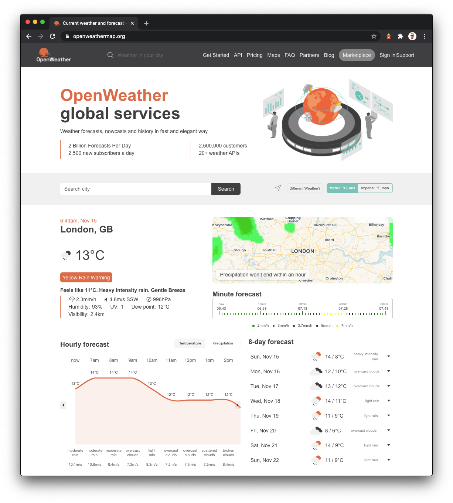
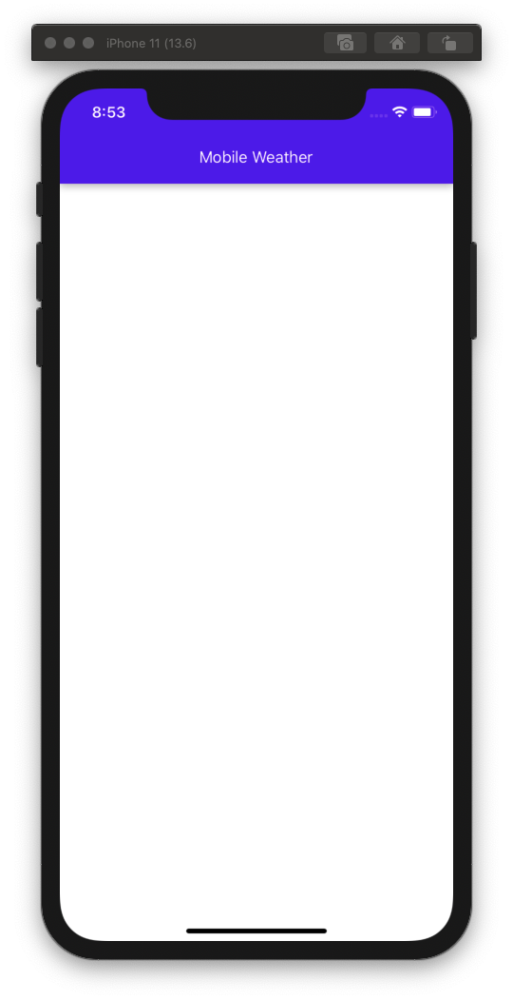
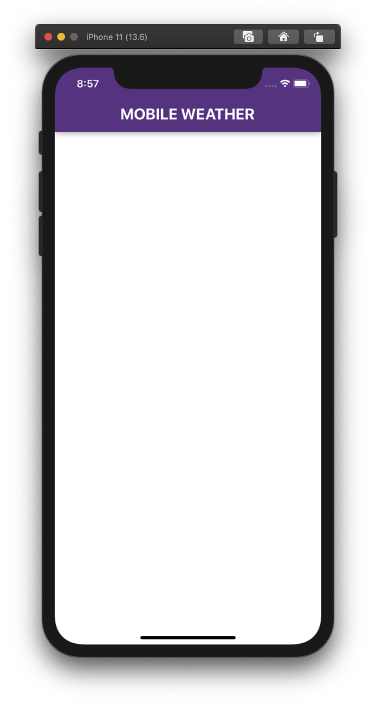
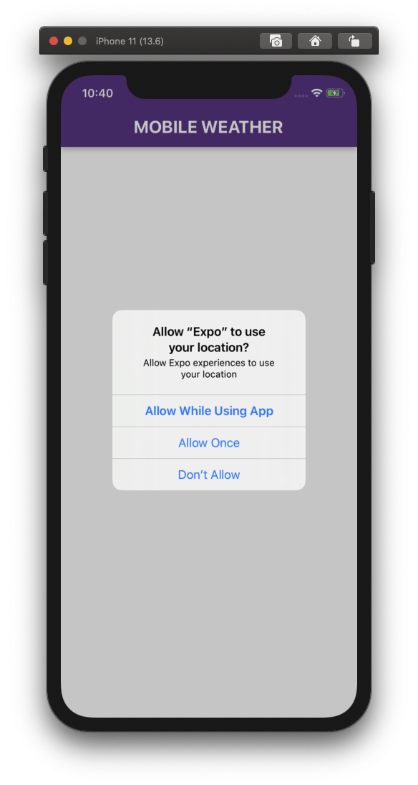
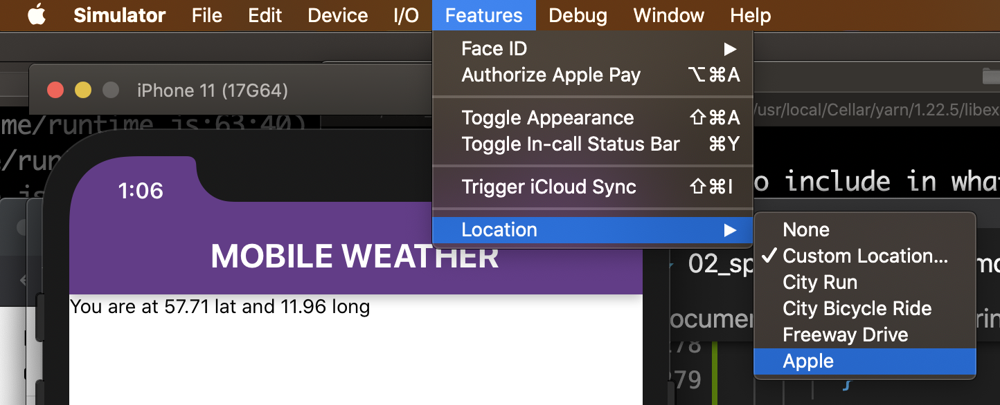
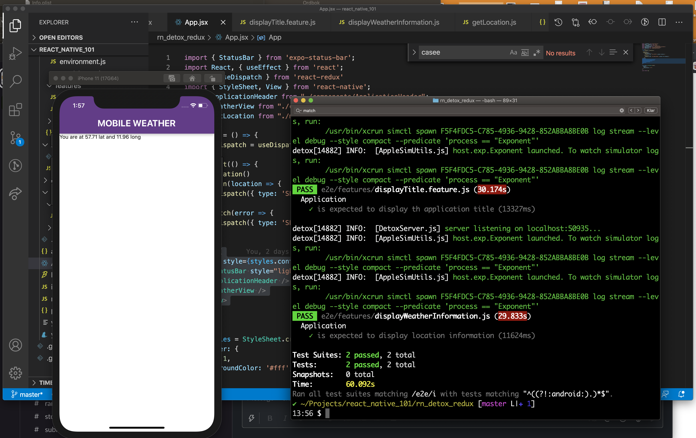

## Getting the location of the device

The purpose of our application is to tell the user the weather conditions. In order to do that, we will make use of the OpenWeatherMap API to get information about the weather conditions at any given location.



We will be making use of the One Call API service that provides the following weather data for any geographical coordinates:

* Current weather
* Minute forecast for 1 hour
* Hourly forecast for 48 hours
* Daily forecast for 7 days
* Government weather alerts
* Historical weather data for the previous 5 days

That's a lot of functionality, but don't worry, we will not use all of that data initially. "Start small" is a mantra of mine. I also like to keep it small over time if I can. In the first iteration of this app, we will explore the parts that will give us Current weather and Daily forecast for 7 days.


[[LO-FIS should go here]]

There are a few things we need to get out of the way before we kan make this happen:
1. We need to know what to look for, so we need to gain access to the current location of the devise.
2. We need to gain access to the API by creating an account with the OpenWeatherMap service
3. We need to make a few test calls to the API to learn about how the response look like and what data we can expect to get
4. We need to be able to mock the call to the OWM [One Call API](https://openweathermap.org/api/one-call-api) in our tests so we can predict the response and be able to build our expectations in the test scenarios.

But lets get started with adding a bit of styling to our application. We want to move past the centred app title and give way for a more app-like display as shown in the low fidelity drafts abowe.

### Part 1 - Styling with React Active Paper

React Native Paper is a collection of customizable components for React Native that follow Google’s Material Design guidelines. Rather than re invnting th wheel and style every part of our application ourselves, we can leverage on th hard work of othrs to get wonderful results.

Install the libarary in your project.

```
$ yarn add react-native-paper
```

Let's start by implementing an application header that will display the title. We can make use of the `Appbar.Header` component described [here](https://callstack.github.io/react-native-paper/appbar-header.html).

At this point, we don't have to modify our test, but rmember to make sur you run it once we are done with the changes and additions. The application title is still supposed to show up, but in a different way.

Create a new component in the `components` folder:

```
$ touch components/ApplicationHeader.jsx
```

We want the following code to be added to that component:

```js
import React from 'react'
import { Appbar } from 'react-native-paper';
import { useSelector } from "react-redux";

const ApplicationHeader = () => {
  const { appTitle } = useSelector(state => state)
  return (
    <Appbar.Header>
      <Appbar.Content title={ appTitle } />
    </Appbar.Header>
  )
}

export default ApplicationHeader
```

Consequently, we want to modify the `<App>` component to display the header, but also relieve it from the responsibility of displaying the `appTitle` dirctly. Since we no longer need that prop, we can safely remove the `useSelector` import, and get rid of the `appTitle` constant. We also no longer need to import the `<Text>` component from `react-native`. Finally, we want to modify our stylesheet and get rid of the vertical and horizontal centering.

On the other hand, we need to import the `<AppplicationHeader>` component and make sure that it is rendered.

That should be it. Did I miss something? The `<App>` component should look something like this after our refactorings:

```js
import { StatusBar } from 'expo-status-bar';
import React from 'react';
import { StyleSheet, View } from 'react-native';
import ApplicationHeader from "./components/ApplicationHeader";

const App = () => {
  return (
    <View style={styles.container}>
      <StatusBar style="light" />
      <ApplicationHeader />
    </View>
  );
}

const styles = StyleSheet.create({
  container: {
    flex: 1,
    backgroundColor: '#fff',
  },
});

export default App
```



Another version of the `<ApplicationHeader>` component, but with some styling addad to it, might look like this:

```js
import React from 'react'
import { Appbar } from 'react-native-paper';
import { useSelector } from "react-redux";
import { Text } from 'react-native';


const ApplicationHeader = () => {
  const { appTitle } = useSelector(state => state)
  return (
    <Appbar.Header style={{ backgroundColor: '#69388C' }}>
      <Appbar.Content
        title={
          <Text
            style={{ fontSize: 24, fontWeight: 'bold' }}>
            {appTitle.toUpperCase()}
          </Text>
        }
      />
    </Appbar.Header>
  )
}

export default ApplicationHeader
```

Please examine the changes we do to this component before implementing this. Why do we bother importing the `<Text>` component here? And is there another way to make the `appTitle` appear all capitals? What else did we change?



### Part 2 - The Location

One of our challenges, before we even can begin thinking about displaying any weather information, is to figure out what to look for. What location are we interested in? There are countless directions we coult go with this, but for learning purposes, we will start with asking the devise where it is currently located.

In order to do that, we will need to understand the basics of **Privacy settings** on mobile operating systems in general, and in iOS in perticular. Privacy settings in iOS help you control  which apps have access to information stored on your device. There are many services that you can control in order to retain your privacy. **Location Service** is just one of them.

With your permission, Location Services will allow apps and websites (including Maps, Camera, Weather, and other apps) to use information from Global Positioning System (GPS) networks, and Bluetooth to determine your approximate location.

The first time an app tries to access your location, it must ask for your permission. You see a prompt explaining which app is asking for permission to use your location as well as the app developer's reason for requesting it.

In our case, once we set up the functionality that will make use of the Location Service, you will see the following prompt (but we are **NOT** there yet).




We will make use of two different packages provided for us by Expo. One that deals with the [Location Service](https://docs.expo.io/versions/latest/sdk/location/), and another one that allows us to tap into the [Persmissions](https://docs.expo.io/versions/latest/sdk/permissions/) flow.

We add these packages to our app:

```
$ expo install expo-location expo-permissions
```

There's another package that we want to install, that will come in handy when we test our application. A bit simplified, it will allow us to execute commands from within our program. When the time comes, we will use it to modify our iOS Simulator (among other things).

```
$ yarn add -D child-process-promise
```

Another packade that we need is provided for us by the developers at Lyft and distributed using Homebrew, and gives us the possibility to pre-set a location of the iOS Simulator using an address or latitude and longitude coordinates.

```
$ brew install lyft/formulae/set-simulator-location
```

Okay, we have the necessary tools to make a determination of where in the world the devise is.

Let's create a new test file and call it `displayWeatherInformation.js`. Here is the code we want to put in it:

```js
describe('Application', () => {

  it('is expected to display location information', async () => {
    let expectedText = 'You are at 57.71 lat and 11.96 long'
    await waitFor(element(by.id('weatherInfo'))).toBeVisible().withTimeout(2000);
    await expect(
      element(by.id('weatherInfo'))
    ).toHaveLabel(expectedText);
  });

});
```
Please note the use of `waitFor()` that is followed by `withTimeout()`. This is an important step. We want Detox to wait for a while before it moves over to the next line of code, in order to give the application enough time to actually get the location and dispalay it in the view. Another important thing is that we are assuming that we will have an element with `testId` value set to `weatherInfo` and that it will have a text value of `'You are at 57.71 lat and 11.96 long'`. Those coordinates are in Gothenburg. It will be a challenge to make this tast pass! Let's get after it.


We will start by creating a new file in the `modules` folder. We will call it `getLocation.js`

```js
import * as Location from 'expo-location';
import * as Permissions from 'expo-permissions';

const getLocation = async () => {
  const { status } = await Permissions.askAsync(Permissions.LOCATION);
  if (status === 'granted') {
    let location = await Location.getCurrentPositionAsync({ enableHighAccuracy: true });
    return location
  } else {
    throw new Error('Permission to access location was denied')
  }
}

export default getLocation
```

What happends here? We import the two packages that will allow us to set the permission to use the Location Service and to actually query the device for its current position.

The status of the permission we are looking for is `'granted'`. If it is set to `'granted'`, we'll go ahead and ask the device for its current location. If not, we'll throw an error.

Next, we need to modify our `App.jsx` to make use of the `getLocation()` function we just created, and invoke it when the component is mounted. For that purpose, we'll be using the `useEffect` hook from React. Another thing that we'll make use of is our application state and the `useDispatch` hook from `react-redux`, to save the location or the error message the `getLocation` might return.

Please note that I only include the additions or changes to the code in the snippet below, and omit the parts that stay the same from previous implementation.

```js
import React, { useEffect } from 'react';
import { useDispatch } from 'react-redux'
import getLocation from "./modules/getLocation";

const App = () => {
  const dispatch = useDispatch()

  useEffect(() => {
    getLocation()
      .then(location => {
        dispatch({ type: 'SET_LOCATION', payload: location })
      })
      .catch(error => {
        dispatch({ type: 'SET_ERROR_MESSAGE', payload: error.message });
      })
  }, []);
}

```

As mentioned before, we have two possible outcomes of the `getLocation()` function. We either get the location, or we get an error message. Whatever happends, we want to deal with it. My idea is that we dispatch an action that saves the data in out appliction state. Hence the `'SET_LOCATION'`, and the `'SET_ERROR_MESSAGE'` actions.

This means that we need to modify our `rootReducer` to deal with thse actions. If you recall, the only thing our reducer do at the moment, i to return the `initialState`.  We will change that behaviour now.

Let's open the `state/reducers/rootReducer.js` file, and make the following modifications:

```js
const rootReducer = (state = initialState, action) => {
  switch (action.type) {
    case 'SET_LOCATION':
      return {
        ...state,
        currentLocation: action.payload
      }
    case 'SET_ERROR_MESSAGE':
      return {
        ...state,
        errorMessage: action.payload
      }
    default:
      return state
  }
}
```

Now, our state will either hold the `currentLocation` or `errorMessage` keys with the values we dispatched from our component.

**Remember to keep running your tests. I know it's time-consuming and annoying when they go red but do it anyway. It's a good habit.**

So, let's put the values we added to state to use. Create a new file in the `components` folder and call it `WatherView.jsx`. We will create a new functional component that will subscribe to the `currentLocation` and `errorMessage` values (making use of `useSelector` hook as we did before).

```js
import React from 'react'
import { useSelector } from 'react-redux'
import { StyleSheet, Text, View } from 'react-native'

const WeatherView = () => {
  const { currentLocation, errorMessage } = useSelector(state => state)
  return (
    <View>
      { errorMessage &&
        <Text>{errorMessage}</Text>
      }
      {
        currentLocation &&
        <Text testID='weatherInfo'>
          You are at {currentLocation.coords.latitude.toFixed(2)} lat and {currentLocation.coords.longitude.toFixed(2)} long
        </Text>
      }
    </View>
  )
}

export default WeatherView

const styles = StyleSheet.create({})
```

We need to `import` this component into our `<App>` component and display it. Make the appropriate change in `App.jsx`:

```js
import WeatherView from "./components/WeatherView";
```
And in the `return` of the `<App>` component:

```js
  return (
    <View style={styles.container}>
      <StatusBar style="light" />
      <ApplicationHeader />
      <WeatherView />
    </View>
  );
```

If you run your tests now, they will still fail, although if you run the application manually in the simulator, you should see the location. You might have to navigate to **Features -> Location** and choose a **Custom Location** or **Apple** to actually set the location to something other than `null`



Here's where the `set-simulator-location` and `child-process-promise` comes into play.

We need to tell our simulator that we want it so start with a pre-set location. In order to do that we need to execute a command from our Detox setup. It's not that super tricky, but to be on the safe side, I'll include the whole `e2e/conffig/nvironment.js` file as it should look after the modifications are done.


```js
import { cleanup, init } from "detox";
import adapter from "detox/runners/jest/adapter";
import { reloadApp } from 'detox-expo-helpers';
import { exec } from "child-process-promise";

jest.setTimeout(120000);
jasmine.getEnv().addReporter(adapter);

beforeAll(async () => {
  await init()
});

beforeEach(async () => {
  await adapter.beforeEach();
  await reloadApp({
    permissions: { location: 'inuse' },
  })
  exec('set-simulator-location -c 57.7132122 11.96223453')
});

afterAll(async () => {
  await adapter.afterAll();
  await cleanup();
});
```

The important parts are:
* the `import` and use of the `exec` function we get from `child-process-promise`. We use it to execute the `set-simulator-location` command.
* The options we pass in to `reloadApp` telling the simulator that we want to permit the use of the Location Service.

Despite this, whenever we run our tests, the simulator will display a pop-up asking us for permission to allow the user currently running the application to access Location. This is a behaviour of the Exponent.app and we nd to deal with it.

Modify your tests by adding a `beforeEach` block (inside the `describe` block):

```js
beforeEach(async () => {
  try {
    await element(by.label('Allow')).atIndex(1).tap()
  }
  catch (e) { }
});
```

Why do we use `try` with an empty `catch` block? Well, the permission is only needed once and the dialog window might not pop up every time.

If we run all our tests now, we should be going green.





**The next step is to make use of the location data we just got, and get the weather API to tell us what we need to know in order to display relevant information to our users.**
