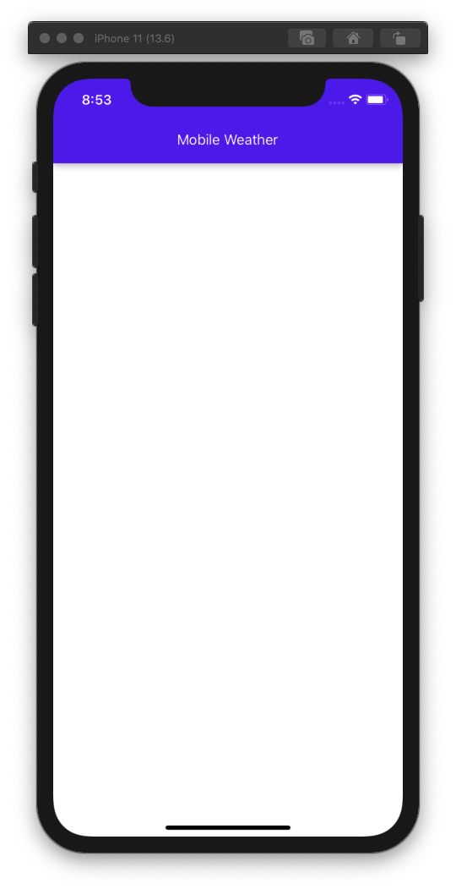
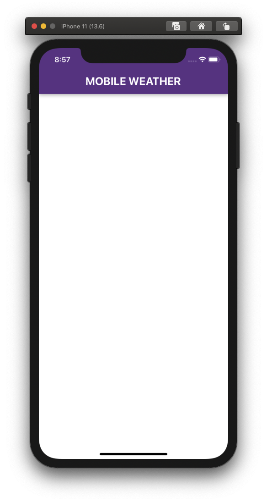
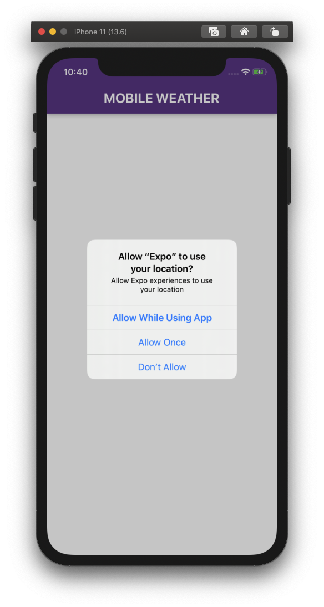

## Building functionality

We will make use of the OpenWeatherMap API to get information about the weather conditions at any given location.


We will be making use of the One Call API service that provides the following weather data for any geographical coordinates:

* Current weather
* Minute forecast for 1 hour
* Hourly forecast for 48 hours
* Daily forecast for 7 days
* Government weather alerts
* Historical weather data for the previous 5 days

That's a lot of functionality, but don't worry, we will not use all of that data initially. "Start small" is a mantra of mine. I also like to keep it small over time if I can. In the first iteration of this app, we will explore the parts that will give us Current weather and Daily forecast for 7 days.


[[LO-FIS should go here]]

There are a few things we need to get out of the way before we kan make this happen:
1. We need to know what to look for, so we need to gain access to the current location of the devise.
2. We need to gain access to the API by creating an account with the OpenWeatherMap service
3. We need to make a few test calls to the API to learn about how the response look like and what data we can expect to get
4. We need to be able to mock the call to the OWM [One Call API](https://openweathermap.org/api/one-call-api) in our tests so we can predict the response and be able to build our expectations in the test scenarios.

But lets get started with adding a bit of styling to our application. We want to move past the centred app title and give way for a more app-like display as shown in the low fidelity drafts abowe.

### Part 1 - Styling with React Active Paper

React Nativ Paper is a collection of customizable components for React Native that follow Google’s Material Design guidelines. Rather than re invnting th wheel and style every part of our application ourselves, we can leverage on th hard work of othrs to get wonderful results.

Install the libarary in your project.

```
$ yarn add react-native-paper
```

Let's start by implementing an application header that will display the title. We can make use of the `Appbar.Header` component described [here](https://callstack.github.io/react-native-paper/appbar-header.html).

At this point, we don't have to modify our test, but rmember to make sur you run it once we are done with the changes and additions. The application title is still supposed to show up, but in a different way.

Create a new component in the `components` folder:

```
$ touch components/ApplicationHeader.jsx
```

We want the following code to be added to that component:

```js
import React from 'react'
import { Appbar } from 'react-native-paper';
import { useSelector } from "react-redux";

const ApplicationHeader = () => {
  const { appTitle } = useSelector(state => state)
  return (
    <Appbar.Header>
      <Appbar.Content title={ appTitle } />
    </Appbar.Header>
  )
}

export default ApplicationHeader
```

Consequently, we want to modify the `<App>` component to display the header, but also relieve it from the responsibility of displaying the `appTitle` dirctly. Since we no longer need that prop, we can safely reemove the `useSelector` import, and get rid of the `appTitle` constant. We also no longer need to import the `<Text>` component from `react-native`. Finally, we want to modify our stylesheet and get rid of the vertical and horizontal centering.

On the other hand, we need to import the `<AppplicationHeader>` component and make sure that it is rendered.

That should be it. Did I miss something? The `<App>` component should look something like this after our refactorings:

```js
import { StatusBar } from 'expo-status-bar';
import React from 'react';
import { StyleSheet, View } from 'react-native';
import ApplicationHeader from "./components/ApplicationHeader";

const App = () => {
  return (
    <View style={styles.container}>
      <StatusBar style="light" />
      <ApplicationHeader />
    </View>
  );
}

const styles = StyleSheet.create({
  container: {
    flex: 1,
    backgroundColor: '#fff',
  },
});

export default App
```



Another version of the `<ApplicationHeader>` component, but with some styling addad to it, might look like this:

```js
import React from 'react'
import { Appbar } from 'react-native-paper';
import { useSelector } from "react-redux";
import { Text } from 'react-native';


const ApplicationHeader = () => {
  const { appTitle } = useSelector(state => state)
  return (
    <Appbar.Header style={{ backgroundColor: '#69388C' }}>
      <Appbar.Content
        title={
          <Text style={{ fontSize: 24, fontWeight: 'bold' }}>{appTitle.toUpperCase()}</Text>
        }
      />
    </Appbar.Header>
  )
}

export default ApplicationHeader
```

Please examine the changes we do to this component before implementing this. Why do we bother importing the `<Text>` component here? And is there another way to make the `appTitle` appear all capitals? What else did we change?



### Part 2 - The Location

One of our challenges, before we even can begin thinking about displaying any weather information, is to figure out what to look for. What location are we interested in? There are countless directions we coult go with this, but for learning purposes, we will start with asking the devise where it is currently located.

In order to do that, we will need to understand the basics of **Privacy settings** on mobile operating systems in general, and iOS in perticular. Privacy settings in iOS help you control  which apps have access to information stored on your device. There are many services that you can control in order to retain your privacy. **Location Service** is just one of them.

With your permission, Location Services will allow apps and websites (including Maps, Camera, Weather, and other apps) to use information from Global Positioning System (GPS) networks, and Bluetooth to determine your approximate location.

The first time an app tries to access your location, it must ask for your permission. You see a prompt explaining which app is asking for permission to use your location as well as the app developer's reason for requesting it.

In our casee, once we set up the functionality that will make use of the Location Service, you will see the following prompt (but we are **NOT** there yet).




We will mak euse of 2 packages from Expo. One that deals with the [Location Service](https://docs.expo.io/versions/latest/sdk/location/), and another that allows us to tap into the [Persmissions](https://docs.expo.io/versions/latest/sdk/permissions/) flow.

We add these packages to our app:

```
$ expo install expo-location expo-permissions
```

There's another package that we want to install and that will come in handy when we test our application. A bit over simplified, it will allow us to execute commands from within our program. When the time comes, we will use it to modify our iOS Simulator among other things.

```
$ yarn add -D child-process-promise
```

Anothr packade that we need is handled by Brew, and gives us the possibility to pre-set a location of iOS Simulator using an address of latitude and longitude coordinates.

```
$ brew install lyft/formulae/set-simulator-location
```

Okay, we have the necessary tools to make a determination of where in the world the devise is.

We will start by creating a new file in the `modules` folder. We will call it `getLocation.js`

```js
```
